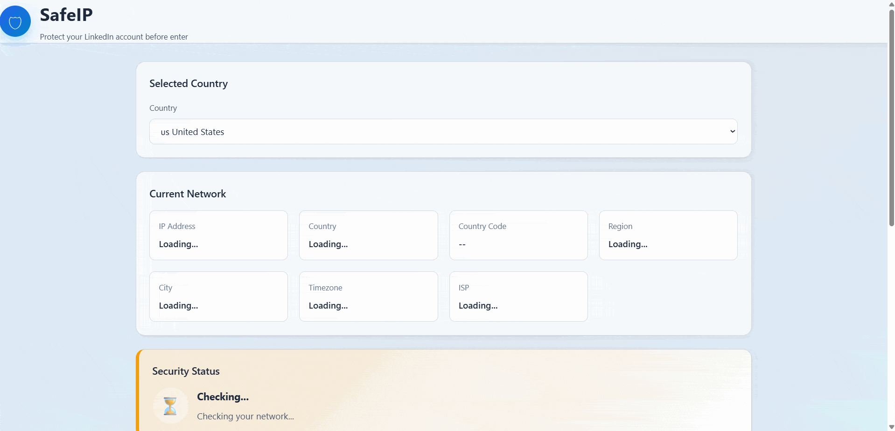

# 🛡 SafeIP

[](https://developer.mozilla.org/docs/Web/HTML)
[](https://developer.mozilla.org/docs/Web/CSS)
[](https://developer.mozilla.org/docs/Web/JavaScript)
[](https://github.com/AhmadJeddi/SafeIP/releases/tag/v1.1.0)
[](LICENSE)
[](https://ahmadjeddi.github.io/SafeIP/)

> A lightweight network security checker that verifies your current IP location before accessing sensitive online services.

SafeIP is a lightweight web application that compares your detected IP location with a user-selected country, helping you identify unexpected network location changes before accessing sensitive online services.

---

## ✨ Features

- 🌍 Detect current IP address
- 📍 Detect network country and location information
- 🏳️ Select expected country manually
- 🔍 Compare detected country with selected country
- ✅ Show network safety status
- 🔒 Prevent login when the network does not match expectations
- 📋 Copy current IP address
- 🔄 Refresh network information
- 💾 Save user preferences using LocalStorage
- 📱 Responsive design

---

## 🔐 Network Security Validation

SafeIP performs multiple security checks:

- ✅ Internet availability check
- ✅ API response validation
- ✅ Country location verification
- ✅ Protected link access control

---

## 🔗 Quick Links

SafeIP includes a protected quick link manager.

Features:

- Create custom links
- Assign custom colors
- Save links locally
- Delete links
- Drag & drop ordering
- Disable links when network is unsafe
- Enable links after successful validation

---

## 🚀 How It Works

SafeIP follows this workflow:

```
User selects expected country
            |
            ↓
SafeIP retrieves network information
            |
            ↓
IP location is analyzed
            |
            ↓
Country comparison is performed
            |
            ↓
Security status is displayed
```

---

## 🖥️ Preview

The demo below showcases the three possible network states:

<p align="center">
  
</p>

### 🟢 Safe Network

The detected IP country matches the selected country.

Example:

```
Selected Country: Iran
Detected Country: Iran

Status:
Safe Network
```

---

### 🟡 Warning

The network information is incomplete or unavailable.

Example:

```
Network information service temporarily unavailable
```

---

### 🔴 Unsafe Network

The detected country does not match the selected country.

Example:

```
Selected Country: Iran
Detected Country: Germany

Status:
Unsafe Network
```

---

## 🏗️ Project Structure

```
SafeIP/
├── index.html                   # Main application page
│
├── assets/
│   ├── logo.png                 # Application logo
│   └── preview.gif              # Project demo animation
│
├── css/
│   ├── reset.css                # Browser style normalization
│   ├── variables.css            # Global design variables
│   └── style.css                # Application styling
│
├── js/
│   ├── app.js                   # Application entry point
│   ├── api.js                   # Network information service
│   ├── storage.js               # LocalStorage management
│   ├── ui.js                    # User interface controller
│   ├── validator.js             # Security validation logic
│   ├── countries.js             # Country database
│   ├── quick-links-validator.js # Quick links validation
│   └── config.js                # Application configuration
│
├── README.md
├── project_structure.md
└── LICENSE
```

---

## ⚙️ Technologies Used

- HTML5
- CSS3
- Vanilla JavaScript (ES Modules)
- Fetch API
- LocalStorage API
- Public IP Geolocation APIs

---

## 🔌 API Services

SafeIP uses multiple IP services with fallback support.

Current providers:

- GeoJS (Primary)
- IPWho (Fallback)
- IPify (Last fallback)

If one service fails, the application automatically tries another available service.

---

## 📦 Installation

Clone the repository:

```bash
git clone https://github.com/AhmadJeddi/SafeIP.git
cd SafeIP
```

Run the project using any local web server (e.g. VS Code Live Server).

---

## 🔒 Privacy & Security

SafeIP itself does **not**:

- Store your IP address
- Collect personal information
- Require account registration
- Use cookies

Network information is retrieved directly from public IP geolocation services.
User preferences are stored locally in your browser using LocalStorage.

---

## 🔧 Future Improvements

Planned features:

### Security

- VPN / Proxy detection
- WebRTC leak detection
- ASN analysis
- IP reputation checking
- Risk scoring improvements

### User Experience

- Dark / Light theme
- Better animations
- Notification system
- Internationalization

### Data & History

- Network history timeline
- Previous IP comparison
- Security reports

### Platform Expansion

- Browser extension version
- Desktop application
- Advanced firewall integration

---

## 👨‍💻 Author

[**Ahmad JeddiZahed**](https://github.com/AhmadJeddi)

---

## ⭐ Contributing

Contributions are welcome!

If you have ideas, find a bug, or want to improve the project, feel free to open an issue or submit a pull request.

If you find this project useful, consider giving it a ⭐ on GitHub.

---

## 📄 License

This project is licensed under the **MIT License**.

See the [LICENSE](./LICENSE) file for details.
